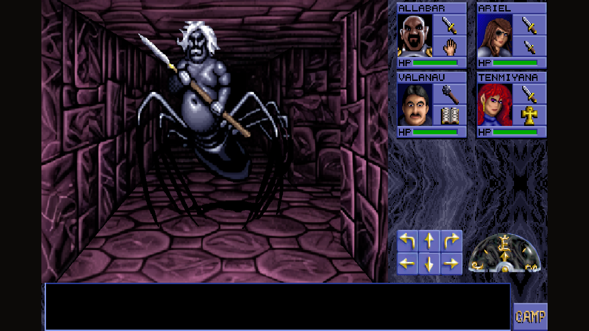
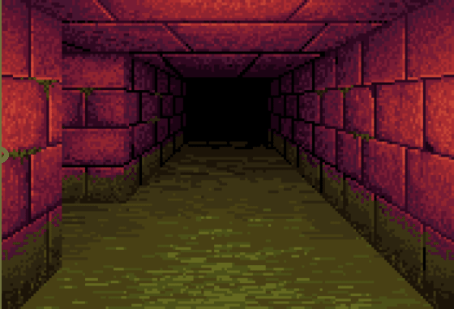
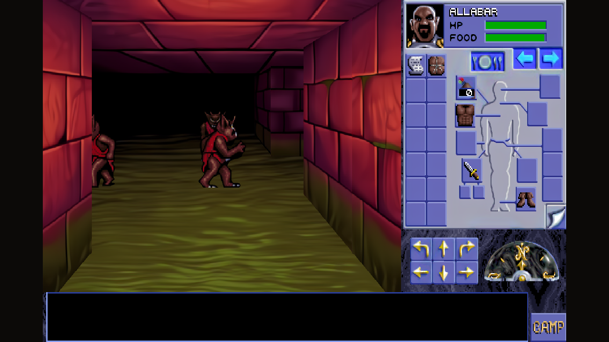
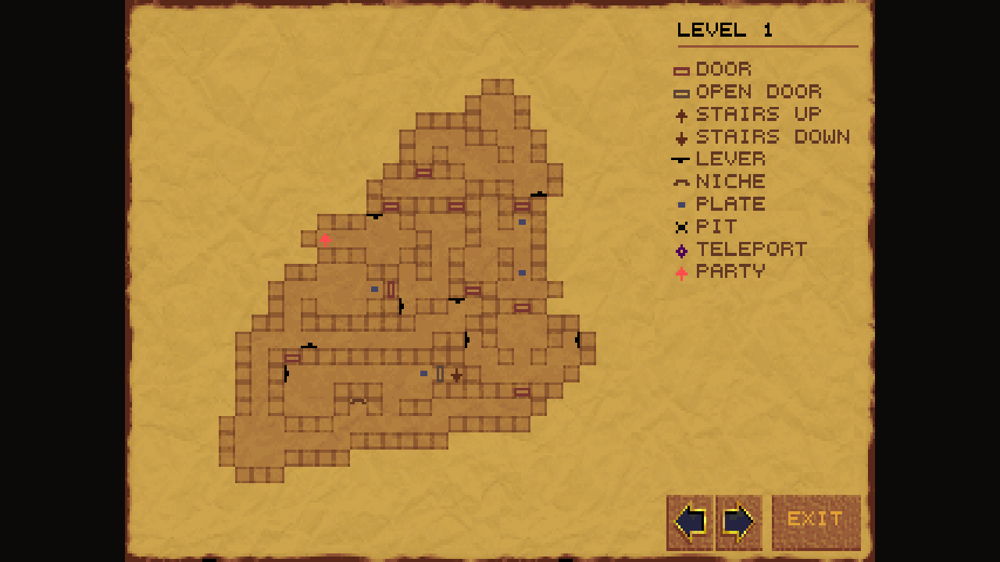
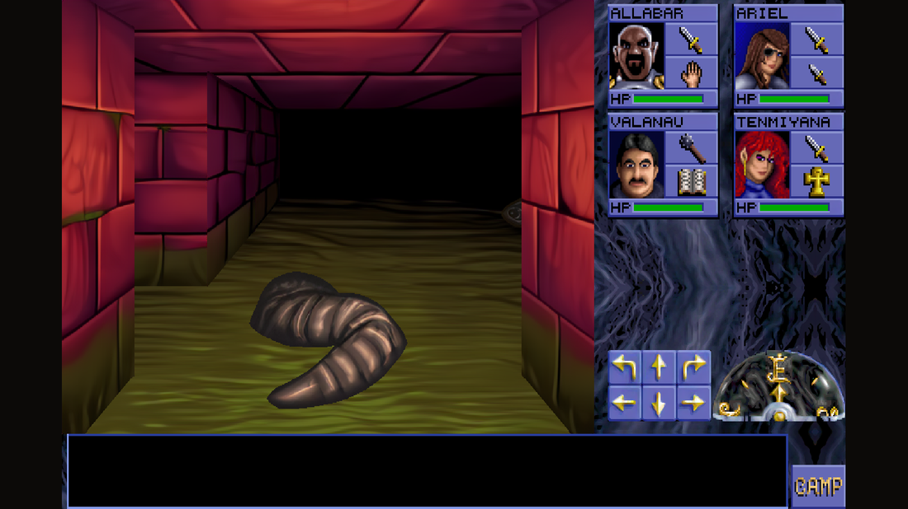
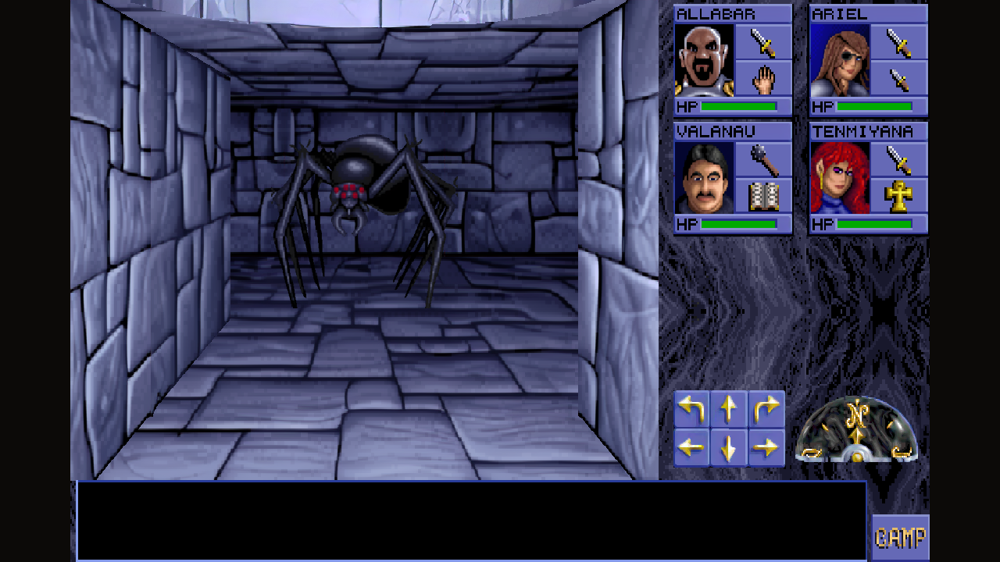
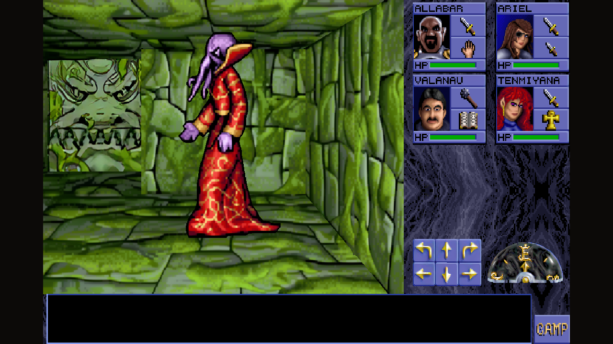
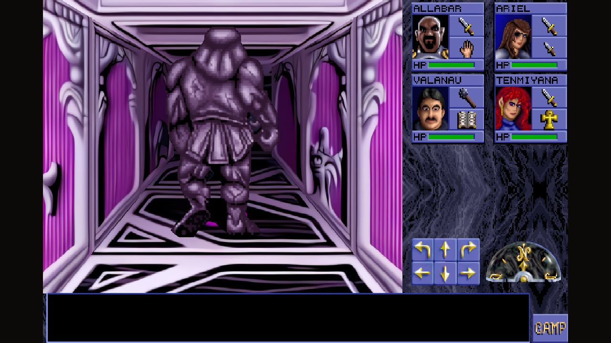

  

# Eye of the Beholder - Remake

A remake of **Eye of the Beholder 1** (Westwood Associates / SSI, 1991) built in
Godot 4.7 on top of the original game's data. The whole thing — the engine, the tools
that dig through the original files, and this page — was written in
[Claude Code](https://claude.com/claude-code) by vibe coding.

The goal is fidelity first: the dungeon geometry, the AD&D rules, the level scripts,
the monster behaviour and every string on screen are read straight out of the original
files, not re-invented. Where the remake adds something, it adds it around the original
rather than on top of it — and everything new can be switched off.

*Level 8, hell hounds in the drow caverns — upscaled artwork, wide layout.*

## Download

Grab the Windows build from [Releases](../../releases), unzip, run
`Eye of the Beholder.exe`. Everything the game needs is inside the archive; nothing
else has to be installed.

Saved games and settings go into a `save` folder next to the executable, so the whole
thing can live on a USB stick. If the game is installed somewhere read-only, such as
`Program Files`, it falls back to the user profile instead.

## Controls

| Key | Action |
| --- | --- |
| Arrow keys, `W` `A` `S` `D` | Move and turn |
| Mouse | Everything else — the interface is the original's: click the floor to pick things up, click a character's weapon to attack |
| `C` | Camp |
| `F2` / `F4` | Save / load game |
| `F6` | Switch between the original artwork and the upscaled pack |
| `F7` | Switch between the wide layout and the original 320×200 one |

## What the original gives us

All twelve dungeon levels with their walls, doors, pressure plates, levers, teleports,
pits and niches. The AD&D rules, experience tables, saving throws and spell effects are
read from `EOB.EXE`, so a fighter levels up exactly when the original says so. The level
scripts run through an interpreter of the original bytecode, which is what makes the
puzzles behave the way they always did. Monsters move and fight in real time, spells
work, items keep their original properties, and the intro sequence and the ending play
out from the original tables.

Every piece of text in the game — menus, item names, the messages in the text window —
comes out of `EOB.EXE`. Nothing is retyped.

## What this remake adds

### Upscaled graphics

An optional art pack rendered through neural upscalers, with the wall pieces, monsters,
items and interface handled by different models and rules, since what flatters a brick
wall ruins a 16×16 item icon. Toggle it with `F6`; the original artwork is always one
keypress away and the two can be compared directly.

*The same corridor, the divider sweeping between the two: the original 320×200 artwork
simply enlarged, and the upscaled pack.*

### Wide layout

The original composes everything into 320×200. This layout keeps every panel pixel-exact
but rearranges them, giving the dungeon view most of the window and drawing a taller
message strip. The stone background is drawn underneath so the panels never carry a
rectangle of marble from somewhere else. Toggle it with `F7`.

*The wide layout with an inventory open: the right column carries the backpack
instead of the party frames, and the dungeon keeps the rest of the window.*

### Lands of Lore automap

The original EOB1 has no automap at all. This one is drawn with the marker artwork from
Westwood's *Lands of Lore* — doors, stairs, levers, niches, pressure plates, pits and
teleports each get their own mark, open doors are drawn differently from closed ones,
and the whole level fits on the parchment without running into the legend.

*Level 1 part way through: only what the party has walked is on the parchment.*

### Sound

The original ships no samples, only OPL2 instrument programs. Those are pre-rendered to
WAV, so the game has its door hinges, its combat, its spells and its four tunes without
an emulator running underneath.

Everything the original plays is here. The dungeon murmurs around you on the first three
levels, on a timer and from a random block nearby, exactly as the original does it — deeper
down each level carries its own ambience in its script instead. A magic missile bangs when
its flight ends, whether it hit something or reached a wall; a thrown dagger clatters from
wherever it landed, quieter the further away that is. Xanathar's death has its own set of
blows and the finale its fanfare.

The intro sequence has a second sound bank whose numbers collide with the in-game one — six
is a door switch in the dungeon and something else entirely in the intro — so it is rendered
and kept separately. The intro fires 45 effects across its six scenes, including the sparks
over Waterdeep and the murmur of the king's court, both as random as the original made them.

### Auto-pickup of thrown weapons

A rock, dagger, spear or arrow returns to the character who threw it as soon as the party
steps on it — into the very slot it left from, or the belt if that slot has been refilled,
or the quiver in the case of ammunition. Anything the player puts down by hand is
deliberately left alone, so a rock can still hold down a pressure plate. Switch it off in
*Camp → Preferences* if you want it strict.

### Quality of life

Save and load from the keyboard rather than through the camp menu, a main menu that
remembers whether a saved game exists, the party auto-compacting when a character is
dropped, and the display options remembered between runs.

## More screenshots

Each group of three levels has its own wall set, and the upscaler was tuned per wall
rather than run over everything at once.

| | |
| --- | --- |
|  |  |
| *Level 1 — the brick sewers under Waterdeep.* | *Level 5 — the blue dwarven halls.* |
|  |  |
| *Level 11 — a mind flayer in the green caves.* | *Level 12 — a golem in Xanathar's lair.* |

## What is missing

The `Esc` key does nothing in game — quit through *Camp → Game Options → Quit Game*.

## Notes

The game data itself is not in this repository. The build is produced from a personal
copy of the original game, and the graphics, sounds and maps are baked into the package
at build time.
